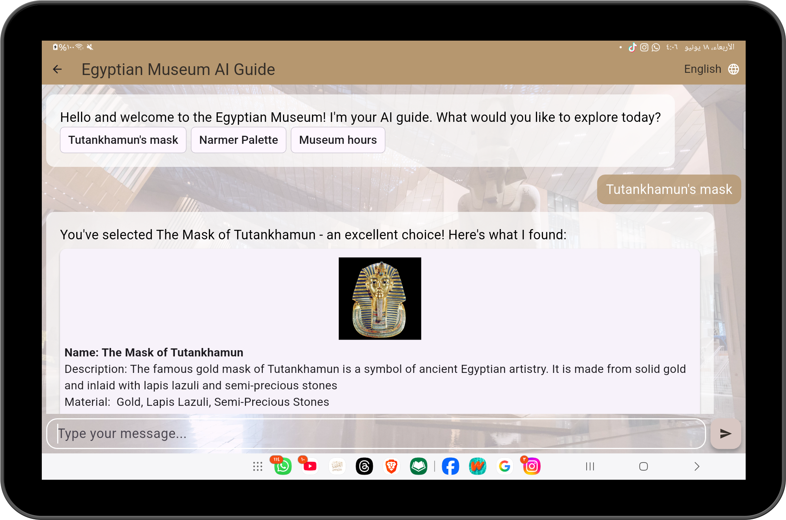
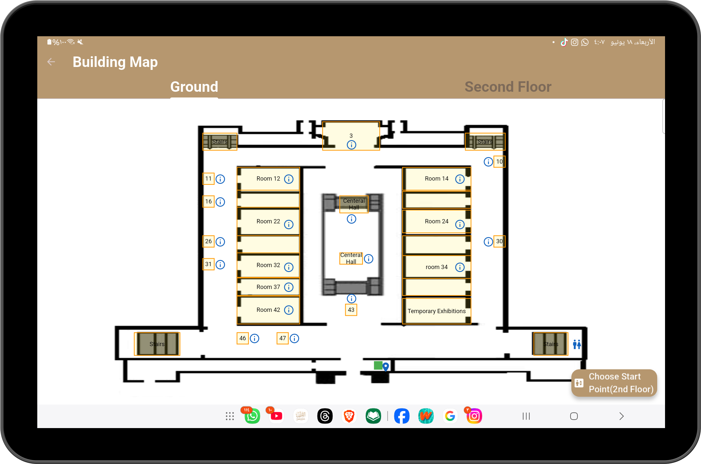
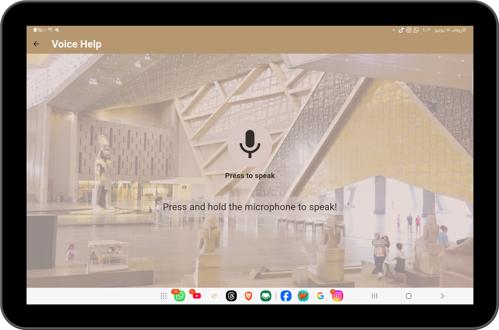
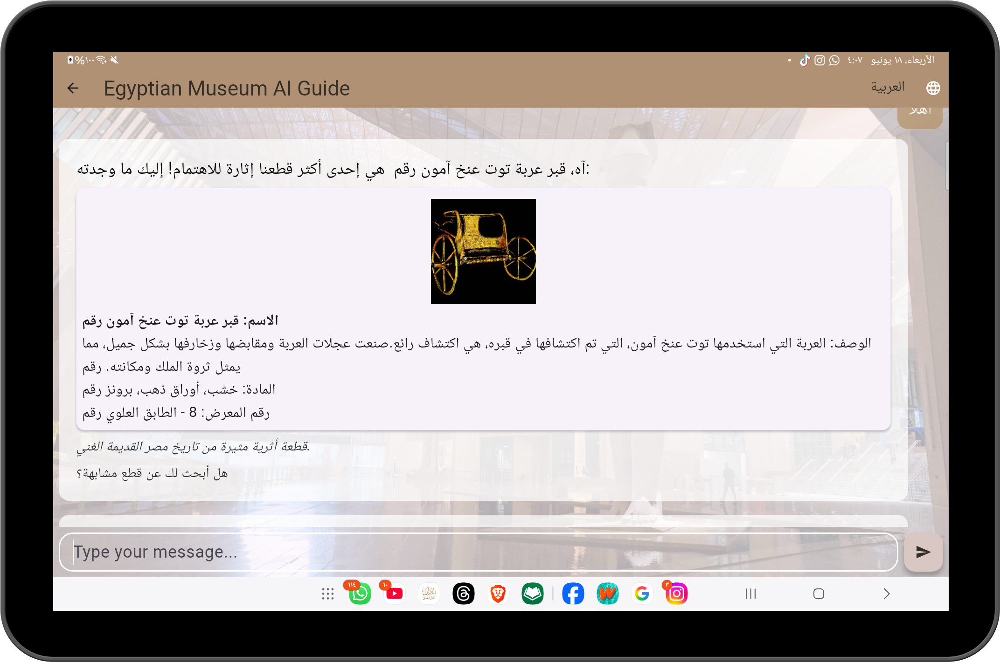
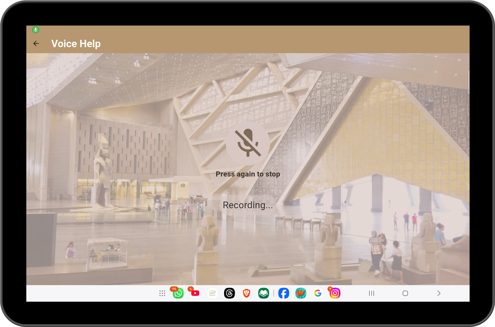
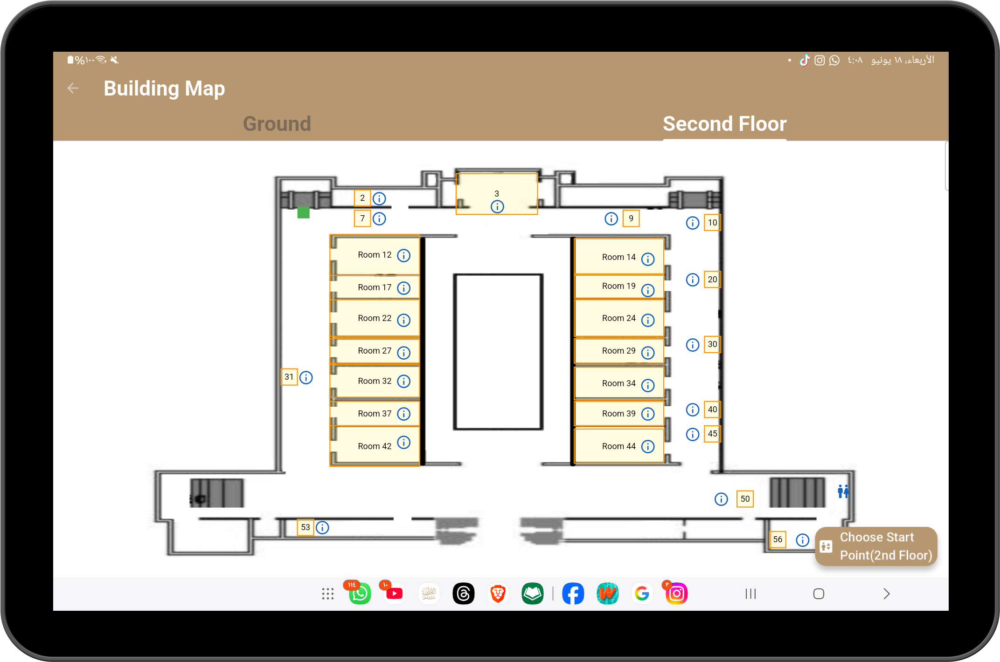
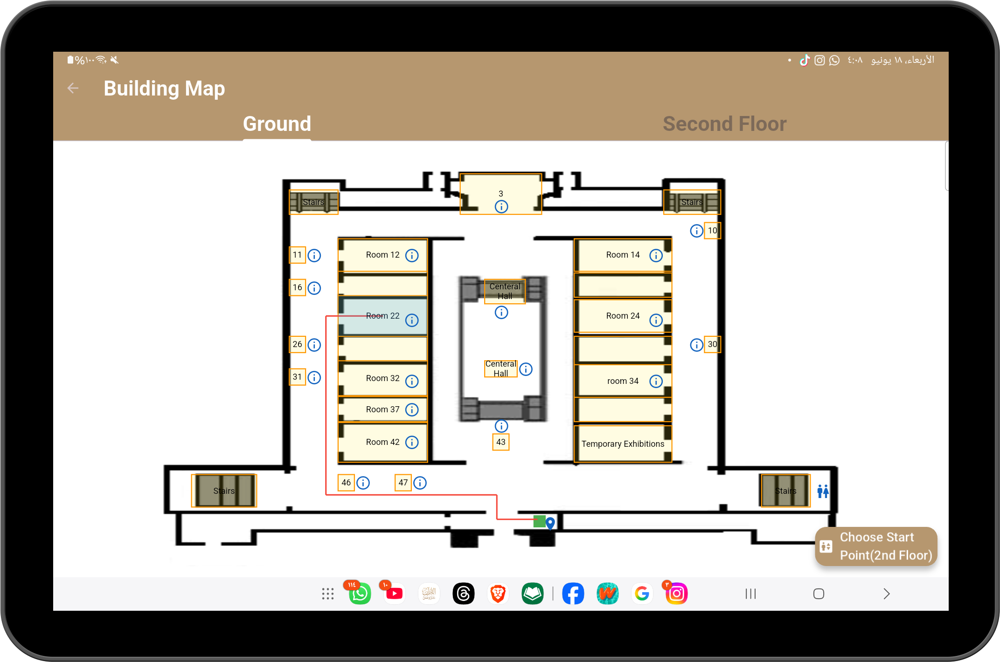
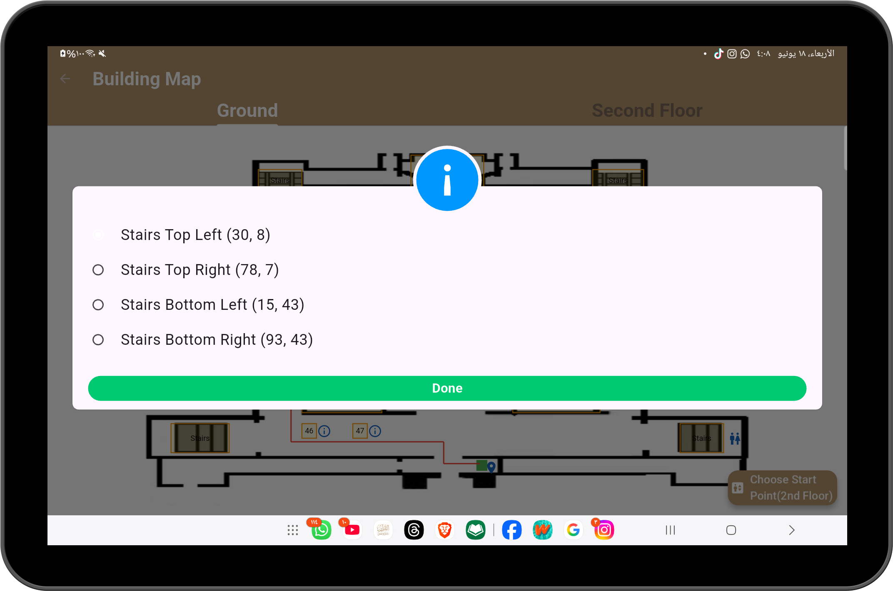

# 🤖 Rafiqi – AI Customer Service Assistant Robot

Rafiqi is my **graduation project**, a multilingual AI-powered customer service robot designed to enhance museum experiences.
It combines **AI models, Flutter mobile app, and Raspberry Pi hardware** to provide a smart, interactive assistant.

---

## ✨ Features

* 🗣️ **Voice Interaction** – Speak naturally with the assistant.
* 💬 **AI Chatbot** – Get instant responses to your questions.
* 🗺️ **Smart Map Navigation** – Interactive museum guide with directions.
* 🌍 **Multilingual Support** – Supports multiple languages for inclusivity.

---

## 📱 App Screenshots

| Welcome Screen          | Chat Screen       | Map Screen      | Voice Page          |
|-------------------------|-------------------|-----------------|---------------------|
|  |  |  |  |

| Arabic chat Screen             | English Chat Screen |
|--------------------------------|---------------------| 
|  |    |


| listen Screen            | Response Screen    |
|--------------------------|--------------------| 
|  |  |


| Map Screen      | Secound Floor Map Screen   | Map selected Screen          | stairs Dialog          |
|-----------------|----------------------------|------------------------------|------------------------|
|  |  |  |  |

---

## 🛠️ Tech Stack

* **Frontend:** Flutter 
* **Backend:** Python (AI Models with TensorFlow & TFLite)
* **Hardware:** Raspberry Pi 4, Camera Module
* **AI Models:**

    * Automatic Speech Recognition (ASR)
    * Text correction & completion
    * Chatbot model
    * Face tracking

---

## 🚀 Getting Started

Clone the repo:

```bash
git clone https://github.com/yoyo3257/Rafiqi-AI-assistance-robot-flutter-app
cd rafiqi
```

Run the Flutter app:

```bash
flutter pub get
flutter run
```

---

## 📌 Future Improvements

* Expand to other museums & customer service applications.
* Support more languages & dialects.
* Enhance face tracking & emotion recognition.

---
"# Rafiqi-AI-assistance-robot-flutter-app" 
"# Rafiqi-AI-assistance-robot-flutter-app" 
"# Rafiqi-AI-assistance-robot-flutter-app" 
"# Rafiqi-AI-assistance-robot-flutter-app" 
